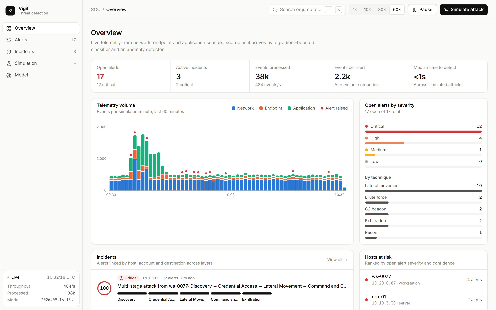
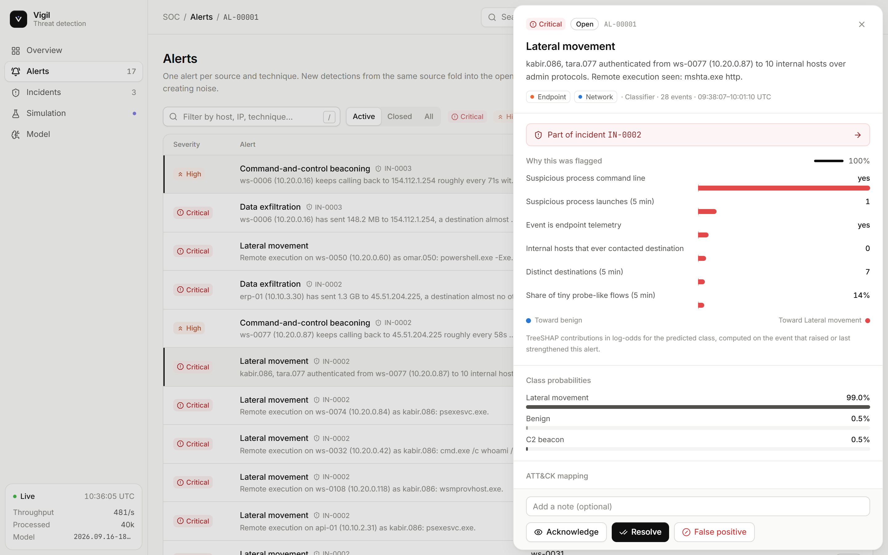
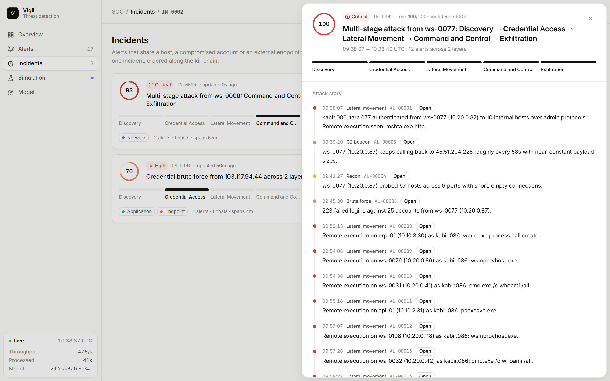
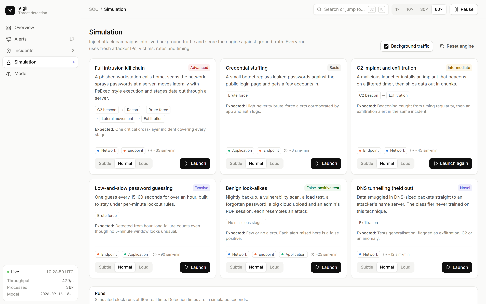
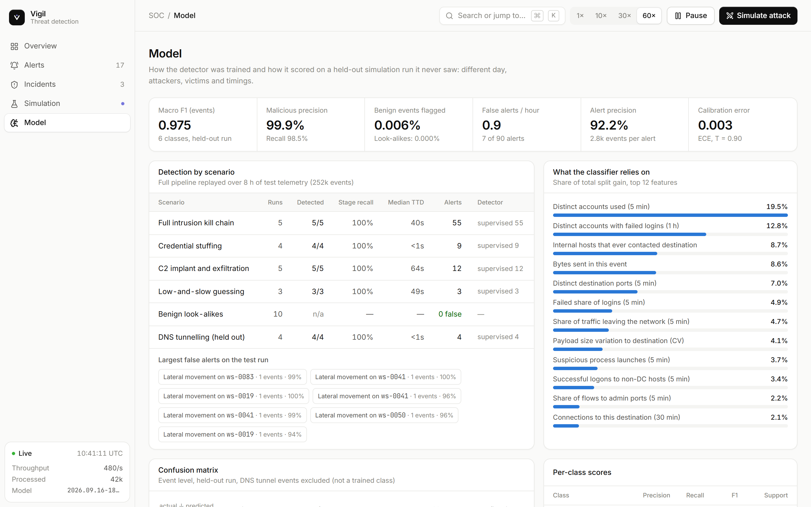

# Vigil

An AI-driven threat detection and attack simulation engine, with a SOC dashboard for triage.

Vigil scores network, endpoint and application telemetry as it arrives. It folds detections into alerts, links alerts
across hosts and layers into incidents mapped to MITRE ATT&CK, explains every verdict, and drafts a response playbook.
A built-in simulator injects realistic attack campaigns into live background traffic, so detection can be
measured against ground truth instead of claimed.



## The problem

A SOC drowns in low-level events from separate tools: firewalls and flow logs, EDR and authentication logs, web
server logs. Real attacks leave faint traces in each of them, and look-alike benign activity (backups, vulnerability
scans, load tests, admins at work) produces most of the noise. The brief was to build an engine that:

- detects brute force, lateral movement, command-and-control beaconing and data exfiltration from raw multi-layer logs,
- keeps false positives low on benign activity that resembles attacks,
- correlates signals across layers into incidents and places them on the kill chain,
- explains why something was flagged and says what to do next,
- simulates attacks to prove all of the above.

## How it works

```
 simulator ──► raw events ──► streaming features ──► classifier + anomaly model ──► alerts ──► incidents ──► dashboard
 (or /api/ingest)            5 min / 1 h / per-pair     LightGBM, TreeSHAP          one per      entity graph     SSE
                             windows, asset context     IsolationForest             source and   across hosts,
                                                                                    technique    accounts, C2
```

**Telemetry.** Events are raw sensor records: network flows, authentication attempts, process launches and HTTP
requests. No event carries precomputed behaviour such as "failed logins per minute".

**Features** (`vigil/features.py`). A streaming extractor keeps O(1) rolling state per source: 5-minute and 1-hour
windows (failed logins, distinct accounts, destinations and ports, bytes in and out), per source-destination timing
(beacon regularity as the coefficient of variation of connection gaps), destination prevalence across the fleet, and
the source's role from the asset inventory. Training replays simulated telemetry through the same class, so the
model trains on exactly what it sees live.

**Models** (`vigil/train.py`, `vigil/model.py`)
- A LightGBM multiclass model over 44 features and six classes (benign, recon, brute force, lateral movement, C2,
  exfiltration). Classes are weighted, and benign look-alikes get three times the weight as hard negatives.
- Temperature scaling fitted on validation data, and an alert threshold on P(malicious) chosen to favour precision
  (F0.5).
- Per-alert TreeSHAP explanations from LightGBM's native `pred_contrib`.
- An isolation forest trained only on benign traffic, for behaviour no class describes. It is tuned to stay quiet.

**Alerting and correlation** (`vigil/detection.py`). Detections from the same source and technique fold into one
alert, instead of one alert per event. Alerts join into an incident when one actor pivots into another (A's target is
B's source), when they share a compromised account or external C2 infrastructure, or when the same technique hits the
same target at the same time. Incidents carry an ordered attack story, a risk score, ATT&CK techniques and a merged
playbook.

**Honest evaluation.** Train (16 h), validation (6 h) and test (8 h) come from *independent* simulation runs with
different seeds, attackers, victims, rates and times of day. Splitting one run's rows at random would leak
near-identical neighbours of each attack into the test set. DNS tunnelling is never shown to the classifier; it
exists only in the test run, to check generalisation.

## Results on real data

Vigil's detectors are benchmarked on LANL's *Comprehensive, Multi-Source Cyber-Security Events*: 58 days of real
enterprise logs, 1.65 billion events, with a documented red-team campaign as ground truth. Training uses earlier
days only, and the numbers below come from [`models/benchmarks.json`](models/benchmarks.json) via
`python -m vigil.bench report`; none of them is typed by hand.

<!-- LANL:START -->
Test window: days 12–29, 386 labelled red-team logons among 106,704,513 scored authentications (about 1 in 276,436).

| Model | AP | Recall @100 alerts/day | ROC-AUC |
|---|---:|---:|---:|
| first_seen_edge | 0.000 <sub>[0.000, 0.000]</sub> | 0.000 <sub>[0.000, 0.000]</sub> | 0.889 <sub>[0.808, 0.935]</sub> |
| graph_embed | 0.000 <sub>[0.000, 0.000]</sub> | 0.000 <sub>[0.000, 0.000]</sub> | 0.734 <sub>[0.640, 0.813]</sub> |
| random | 0.000 <sub>[0.000, 0.000]</sub> | 0.000 <sub>[0.000, 0.000]</sub> | 0.513 <sub>[0.461, 0.551]</sub> |

Brackets are 95% bootstrap intervals over users. ROC-AUC is reported because published work does, but at this class imbalance it flatters everything: read AP and the alert-budget recall.

Full tables, ablations and published-baseline comparisons: [`docs/BENCHMARKS.md`](docs/BENCHMARKS.md).
<!-- LANL:END -->

## Results on the simulator

Held-out test run: 8 simulated hours, 251,515 events, 31 campaigns.

| Scenario | Runs | Detected | Stage recall | Median time to detect |
|---|---|---|---|---|
| Full intrusion kill chain | 5 | 5 | 100% | 40 s |
| Credential stuffing | 4 | 4 | 100% | <1 s |
| C2 implant and exfiltration | 5 | 5 | 100% | 64 s |
| Low-and-slow password guessing | 3 | 3 | 100% | 49 s |
| DNS tunnelling (never trained on) | 4 | 4 | 100% | <1 s |
| Benign look-alikes | 10 | n/a | n/a | 0 alerts |

| Pipeline metric | Value |
|---|---|
| Alerts raised | 90, from 251,515 events (one per 2,795) |
| False alerts | 7, which is 0.88 per hour (alert precision 92.2%) |
| Incidents | 17; every kill-chain and C2 run is part of one. 2 incidents mix two campaigns |
| Event-level macro F1 | 0.975 (weakest classes: lateral movement 0.926, recon 0.940) |
| Benign events flagged | 0.006% (look-alike scenarios: 0%) |

All seven false alerts are single events on IT admins' workstations, where RDP sessions and encoded PowerShell
look like lateral movement. Of the two mixed incidents, one merges two kill chains that overlapped in time. The other
joins a password-guessing run to a kill chain, because the guessing ran from a host the kill chain had already
reached. Time to detect is measured in simulated seconds, from a stage's first event to the first alert on it. Full
numbers are in [`models/metrics.json`](models/metrics.json) and on the dashboard's Model page.

**Read these numbers with care.** The data is simulated, and real telemetry is messier, so treat them as a regression
baseline, not a production estimate. While building this, I found and removed two shortcuts the simulator had made
too easy: exfiltration could be spotted from upload size alone, and C2 from a malicious launcher that always came
first. Background traffic now includes large benign uploads, and half the implants arrive without a visible launcher.
I also found the correlator merging unrelated attacks through busy servers; links now need a 30-minute proximity and
pivots must be causal. The evaluation now reports how many incidents mix campaigns.
The anomaly model raised no alerts on the test run; the held-out DNS tunnel was caught by the classifier through its
exfiltration features.

## Dashboard

A light-themed triage console:

- **Overview:** telemetry volume by layer, open alerts by severity, incidents on the kill chain, hosts at risk and a live
  event tail.
- **Alerts:** filtering, keyboard triage (`j`/`k`/`↵`, `/`), and a detail drawer with SHAP bars, class probabilities,
  ATT&CK mapping, entities, a checklist playbook, raw evidence and simulation ground truth. Marking an alert as a false
  positive appends it to `data/feedback.jsonl` for the next training run.
- **Incidents:** risk ring, kill-chain progress, the attack story across hosts, and a coordinated response.
- **Simulation:** six scenarios with intensity control, and a live scorecard of when each stage started and when it
  was first alerted on.
- **Model:** the evaluation above: per-scenario detection, confusion matrix, feature importance and limitations.
- **Command menu:** `⌘K` / `Ctrl+K` to jump anywhere, open an alert or launch a scenario.

| Alert triage | Incident |
|---|---|
|  |  |
| **Simulation scorecard** | **Model card** |
|  |  |

## Running it

### Docker

```bash
docker compose up --build        # trains the model during the build (~3 min), then serves everything
open http://localhost:8710
```

Use `TRAIN_FLAGS=--quick docker compose up --build` for a faster, smaller model.

### Locally

Requires Python 3.11+ and Node 20+.

```bash
python -m venv .venv
source .venv/bin/activate          # Windows: .venv\Scripts\activate
pip install -r requirements-dev.txt

python -m vigil.train              # ~2-3 min on a laptop CPU; writes models/
uvicorn vigil.api:app --port 8710  # API + engine

cd web
npm install
npm run dev                        # dashboard on http://localhost:5190, proxied to the API
```

Or run `npm run build` in `web/`, and the API serves the dashboard itself at http://localhost:8710.

### Tests

```bash
pytest                                        # trains a small model once (~1 min), then runs the suite
VIGIL_TEST_MODEL_DIR=models pytest            # reuse the full model
```

## API

| Method | Path | Purpose |
|---|---|---|
| GET | `/api/overview` | Counters, throughput, series, hosts at risk |
| GET | `/api/alerts` | Alert summaries (`status`, `severity`, `threat`, `q`) |
| GET / PATCH | `/api/alerts/{id}` | Full alert with explanation and playbook, or set its status (`acknowledged`, `resolved`, `false_positive`) |
| GET | `/api/incidents`, `/api/incidents/{id}` | Correlated incidents |
| GET | `/api/scenarios` | Simulation catalogue |
| GET / POST | `/api/simulations` | List runs, or launch `{scenario, intensity}` |
| POST | `/api/simulations/{id}/stop` | Stop a run |
| GET / PATCH | `/api/settings` | Simulated clock speed, background traffic, pause |
| POST | `/api/ingest` | Push raw events from an external collector |
| GET | `/api/model` | Model metadata and evaluation |
| GET | `/api/stream` | Server-sent events: `tick`, `alert`, `incident`, `run`, `telemetry` |
| POST | `/api/reset` | Clear engine state |

Interactive docs are at `/docs`.

## Layout

```
vigil/
  schema.py        event type, threat classes, ATT&CK and kill-chain metadata
  environment.py   simulated organisation: assets, roles, users, internet
  simulator.py     background traffic, attack campaigns, benign look-alikes
  features.py      streaming feature extraction
  train.py         dataset generation, training, calibration, evaluation
  model.py         inference and explanations
  detection.py     alert aggregation and incident correlation
  playbooks.py     response playbooks
  runtime.py       simulated clock, scenario injection, event feed
  api.py           FastAPI app and SSE stream
web/               React + TypeScript + Tailwind dashboard (Vite)
tests/             unit, pipeline and API tests
```

## Limitations and next steps

- All telemetry is synthetic. The next step is replaying a public dataset such as CIC-IDS2017 or LANL auth logs through `/api/ingest`, with a feature adapter.
- Asset roles are model features, so a compromised scanner or backup server would be under-scored.
- State lives in memory. A deployment would put events on a queue and alerts in a database.
- Retraining from analyst feedback is manual.
